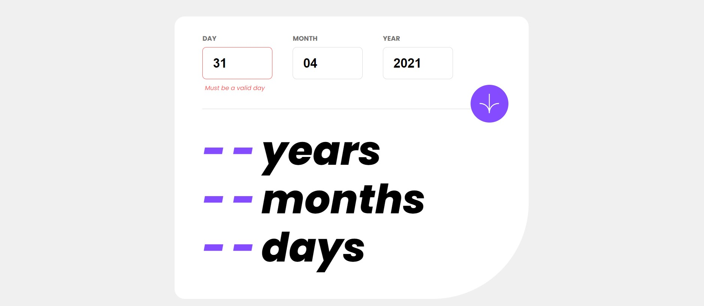

# Frontend Mentor - Age calculator app solution

This is a solution to the [Age calculator app challenge on Frontend Mentor](https://www.frontendmentor.io/challenges/age-calculator-app-dF9DFFpj-Q). Frontend Mentor challenges help you improve your coding skills by building realistic projects. 

## Table of contents

- [Overview](#overview)
  - [The challenge](#the-challenge)
  - [Screenshot](#screenshot)
  - [Links](#links)
- [My process](#my-process)
  - [Built with](#built-with)
  - [What I learned](#what-i-learned)
  - [Continued development](#continued-development)
  - [Useful resources](#useful-resources)
- [Author](#author)
- [Acknowledgments](#acknowledgments)

**Note: Delete this note and update the table of contents based on what sections you keep.**

## Overview

### The challenge

Users should be able to:

- View an age in years, months, and days after submitting a valid date through the form
- Receive validation errors if:
  - Any field is empty when the form is submitted
  - The day number is not between 1-31
  - The month number is not between 1-12
  - The year is in the future
  - The date is invalid e.g. 31/04/1991 (there are 30 days in April)
- View the optimal layout for the interface depending on their device's screen size
- See hover and focus states for all interactive elements on the page
- **Bonus**: See the age numbers animate to their final number when the form is submitted

### Screenshot

### Links

- Solution URL: [Add solution URL here](https://nirglus.github.io/age-calculator-app-main/)
- Live Site URL: [Add live site URL here](https://your-live-site-url.com)

## My process

### Built with

- Semantic HTML5 markup
- CSS custom properties
- Flexbox
- Vanilla JavaScript

### What I learned

In this project, I developed a web application using vanilla JavaScript to calculate a person's age based on their birth date. Through this project, I enhanced my JavaScript skills by practicing various concepts such as working with Date objects, implementing logical calculations for age determination, and validating user input for birth dates. Additionally, I gained experience in handling edge cases such as leap years and ensuring accurate age calculations even when the birth date falls on the current day. Overall, this project served as an excellent opportunity to strengthen my JavaScript proficiency, improve my problem-solving abilities, and enhance my understanding of programming logic.

## Author

- Frontend Mentor - [@nirglus](https://www.frontendmentor.io/profile/nirglus)
- GitHub - [@nirglus](https://github.com/nirglus)

